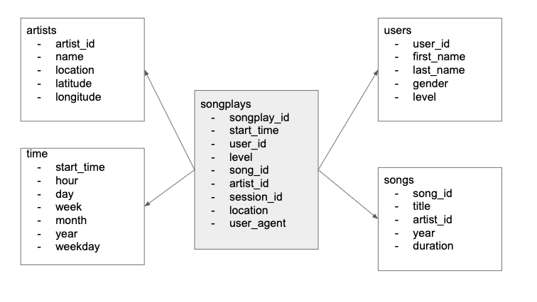

# Sparkify Project of Data Modelling with PostgreSQL
This project is from Udacity's Data Engineering Nanodegree program. This project builds an ETL pipeline with PostgreSQL.

### Getting Started
- Download the project and unzip it or clone the project.


### Prerequisites
- Python 3.5+ --> Download from here https://www.python.org/downloads/
- Postgres --> Download from here https://www.postgresql.org/download/

### Install
You need to install python dependencies. Open your terminal and execute:

```
pip install -r requirements.txt
```

### Executing and Setting Up
After the pre-requisites are satisfied:
In Terminal/CommandPromt:
Create the database and tables by running the following command:
```
python create_tables.py
```
Once the above ran successfully, populate the database by running below command:
```
python etl.py
```

### Data Modelling: Star Schema
We follow the structure present in the image for modelling the data.


### Authors
* **Rupali Sinha** - *Initial work*

